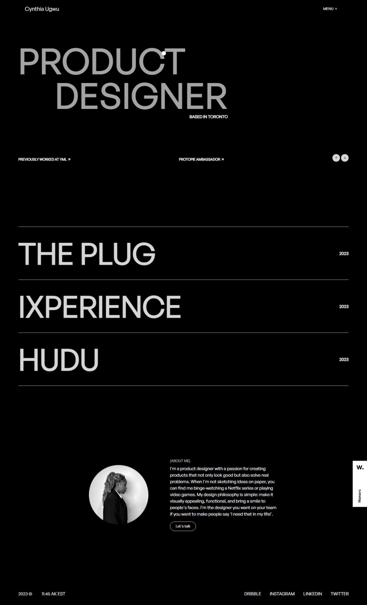

# Awwwards Website Inspiration - Cynthia Ugwu

This project is a website inspired by the stunning design found on [Cynthia Ugwu's Website](https://cynthiaugwu.com/).

## Introduction

The [Cynthia Ugwu Website](https://cynthiaugwu.com/) is a source of inspiration for its elegant design, typography, layout, and overall user experience. This project seeks to capture the essence of her site.

## Getting Started

To get started with this project:

1. Clone this repository to your local machine.

2. Review the code and project structure to understand how we implemented the design.

3. Customize the content and images to make it your own while keeping the professional look intact.

## Technologies Used

This project was built using the following technologies:

- HTML5
- CSS3
- JavaScript
- GSAP

## Acknowledgments

I'd like to express my gratitude to Cynthia Ugwu for her outstanding design, which served as the primary inspiration for this project. Please visit her website at [https://cynthiaugwu.com/](https://cynthiaugwu.com/) to explore her exceptional work and design sensibilities.
