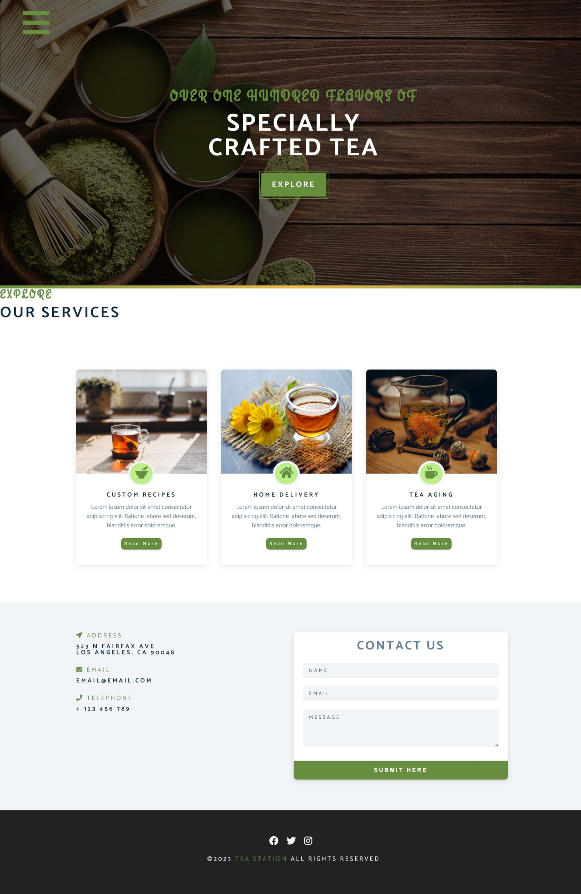
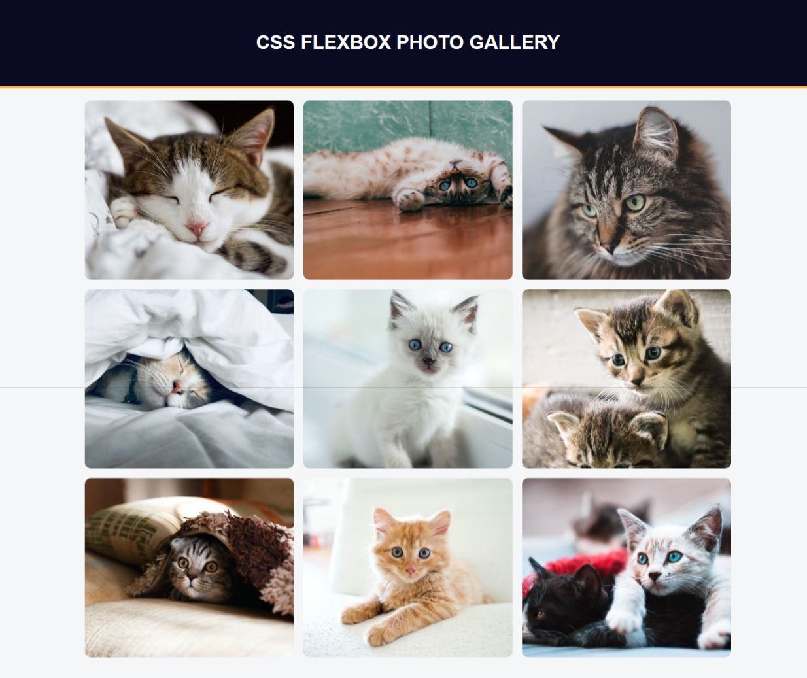
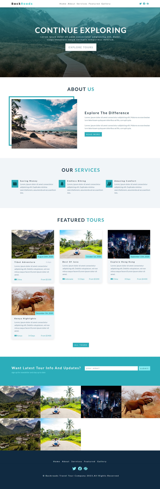
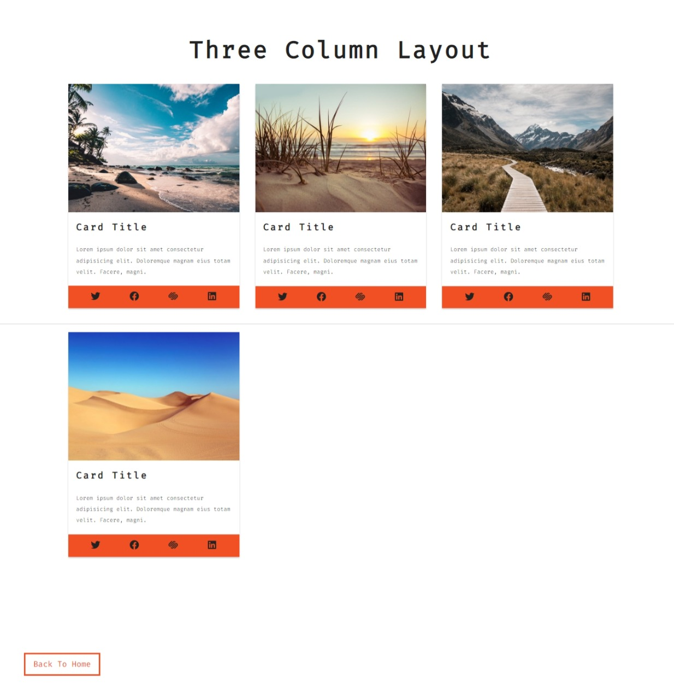
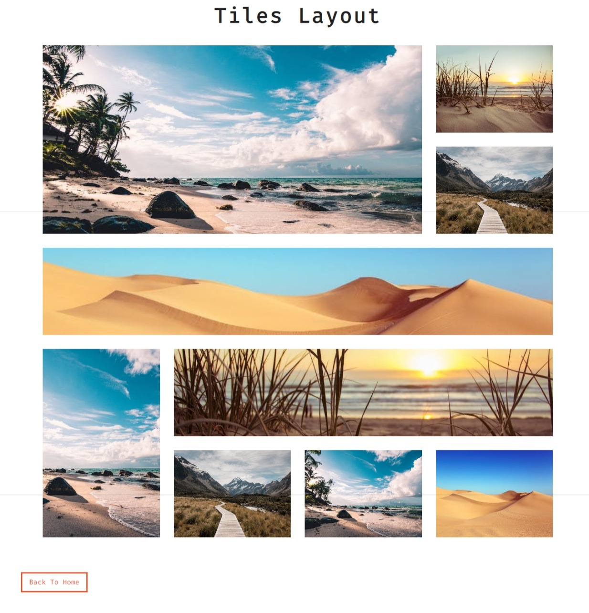
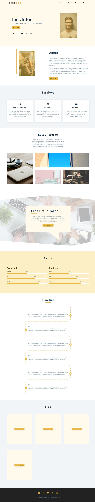

<!-- 

 -->

<h1>PROJECT URL</h1>

<a href="https://css-01-tea-station.netlify.app">01-tea-station</a> 
<a href="https://css-02-flexbox-mini-project.netlify.app">02-flexbox-mini-project</a> 
<a href="https://css-03-backroads-tours.netlify.app">03-backroads-tours(flexbox)</a> 
<a href="https://css-04-grid-mini-project.netlify.app">04-grid-mini-project</a> 
<a href="https://css-05-portfolio.netlify.app">05-portfolio(grid)</a> 
<a href="https://css-06-usability-hub-clone.netlify.app">06-usability-hub-clone</a> 
<a href="https://css-07-simply-recipes.netlify.app">07-simply-recipes</a> 
